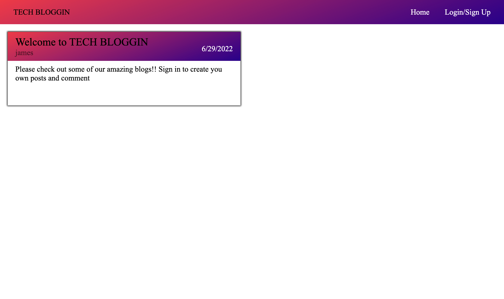
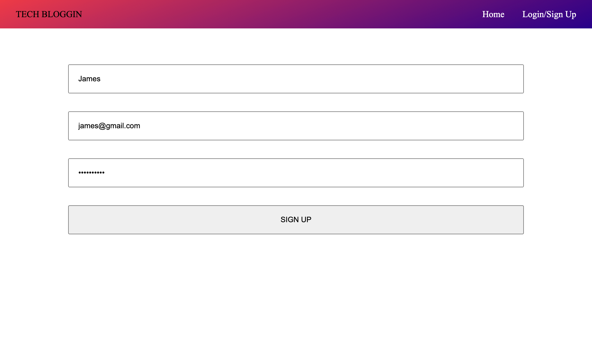
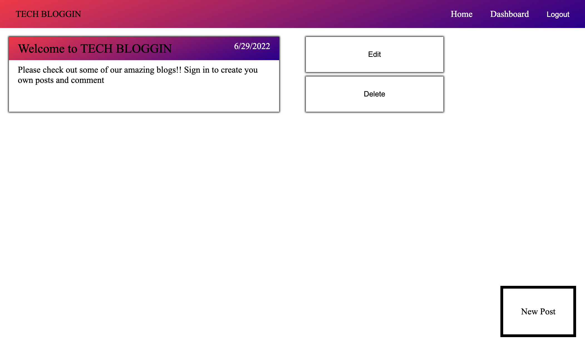
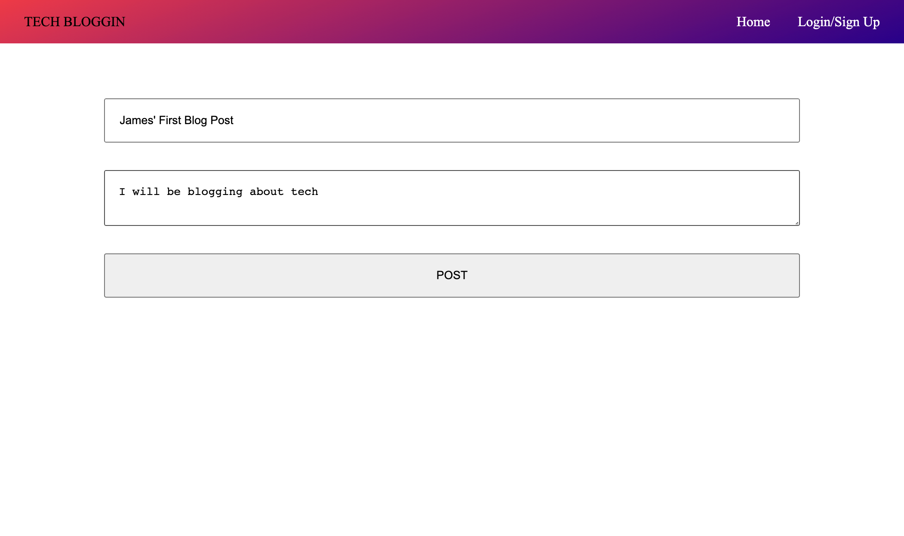

# Full stack Tech Blog

### Description
This app is a full stack app with authentication utilizing sequalize, CRUD operations, and the handlebars template engine 

[Live Site](https://jamestechblog.herokuapp.com/)
### Installation
install dependancies

    npm install 

create .env file
    DB_NAME=   database name
    DB_USER=    maybe root
    DB_PASSWORD= sql password

setup database in mysql shell

    source db/schema.sql

seed database

    npm run seeds

start server

    npm run watch

### Contributions
[Issues and Pull requests can be made to this repo](https://github.com/SuedePritch/bug-free-abandoned-house)

### Technology
* NodeJS
* Express
* Express Sessions
* SQL
* Sequalize
* Handlebars

